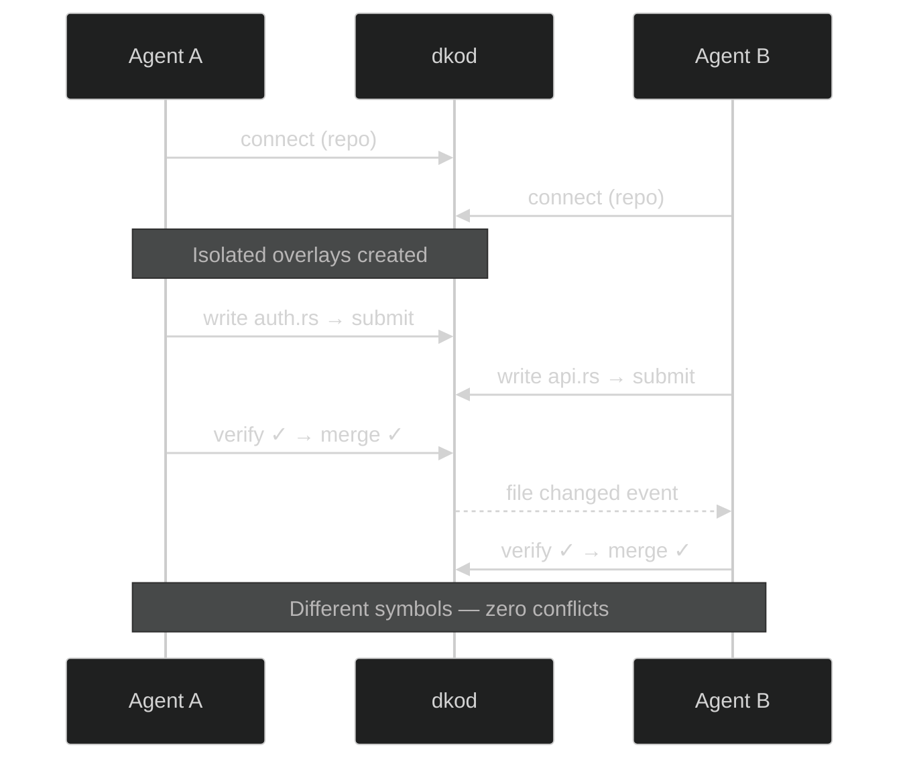

<p align="center">
  <a href="https://dkod.io">
    <picture>
      <source media="(prefers-color-scheme: dark)" srcset=".github/assets/banner-dark.svg">
      
    </picture>
  </a>
</p>

<p align="center">
  <b>Multiple AI agents. One codebase. Zero conflicts.</b>
</p>

<p align="center">
  <a href="LICENSE"></a>
  <a href="https://github.com/dkod-io/dkod-engine"></a>
  <a href="https://dkod.io"></a>
  <a href="https://discord.gg/q2xzuNDJ"></a>
  <a href="https://twitter.com/dkod_io"></a>
</p>

<p align="center">
  <a href="https://dkod.io/docs">Documentation</a> &nbsp;&bull;&nbsp;
  <a href="https://dkod.io/docs/getting-started/quickstart">Quickstart</a> &nbsp;&bull;&nbsp;
  <a href="https://dkod.io/blog">Blog</a> &nbsp;&bull;&nbsp;
  <a href="https://discord.gg/q2xzuNDJ">Discord</a>
</p>

<br>

## The Problem

You deploy 3 AI agents on the same repo. Agent A refactors auth. Agent B adds an endpoint. Agent C writes tests. They all finish in 2 minutes.

Then you spend 45 minutes resolving merge conflicts.

**AI agents are fast. Your infrastructure isn't built for them.**

## The Fix

dkod is an open-source platform purpose-built for concurrent AI code collaboration. It replaces the bottleneck — not the agents.

<br>

<table>
<tr>
<td width="50%" valign="top">

### Session Isolation

**This is not a worktree, not a fork, not a workspace, and not a clone for each agent.**

Each agent gets an isolated session overlay on top of the shared repo. Writes go to the overlay, reads fall through to the base. dkod uses AST-level symbol tracking (via tree-sitter) to understand exactly which functions, classes, and methods each agent is touching — zero-copy, zero-clone, zero-coordination.

**No clones. No locks. No waiting.**

10 agents editing simultaneously, each in their own sandbox.

</td>
<td width="50%" valign="top">

### Semantic Merging

Forget line-based diffs. dkod detects conflicts at the **symbol level** — functions, types, constants.

Two agents editing different functions in the same file? **No conflict.**

Two agents rewriting the same function? Caught instantly, with a precise report.

</td>
</tr>
<tr>
<td width="50%" valign="top">

### Verification Pipeline

Every changeset passes through **lint → type-check → test** gates before it touches main.

Agents get structured failure data — not log dumps — so they fix issues and retry autonomously.

Average time to verified merge: **< 30 seconds.**

</td>
<td width="50%" valign="top">

### Agent Protocol

A gRPC protocol designed for machines, not humans:

```
CONNECT → CONTEXT → SUBMIT → VERIFY → MERGE
```

Structured requests. Structured responses. No parsing logs. No guessing.

Works with any MCP-compatible agent.

</td>
</tr>
</table>

<br>

## Supported Agents

<p>
  <kbd>&nbsp; Cursor &nbsp;</kbd>&nbsp;
  <kbd>&nbsp; Claude Code &nbsp;</kbd>&nbsp;
  <kbd>&nbsp; Cline &nbsp;</kbd>&nbsp;
  <kbd>&nbsp; Windsurf &nbsp;</kbd>&nbsp;
  <kbd>&nbsp; Codex &nbsp;</kbd>&nbsp;
  <kbd>&nbsp; Any MCP Agent &nbsp;</kbd>
</p>

<br>

## Quick Start

**Install the CLI**

```bash
cargo install --git https://github.com/dkod-io/dkod-engine dk-cli
```

**Connect and ship**

```bash
dk login
dk init my-org/my-repo --intent "add user authentication"
dk cat src/main.rs
dk add src/main.rs --content "fn main() { /* ... */ }"
dk commit -m "feat: add auth module"
dk check
dk push
```

<details>
<summary>&nbsp;<b>Use with Claude Code (MCP)</b></summary>

<br>

Add to your MCP config:

```json
{
  "mcpServers": {
    "dkod": {
      "command": "dk",
      "args": ["mcp"]
    }
  }
}
```

Your agent gets these tools:

| Tool | Purpose |
|------|---------|
| `dk_connect` | Open a session for a repo |
| `dk_context` | Semantic code search |
| `dk_file_read` / `dk_file_write` | Read & write files in isolation |
| `dk_submit` | Submit a changeset |
| `dk_verify` | Run the verification pipeline |
| `dk_merge` | Merge verified changes to main |

</details>

<details>
<summary>&nbsp;<b>Use with Cursor, Cline, or Windsurf</b></summary>

<br>

Each editor connects through the same MCP bridge. See the [agent setup docs](https://dkod.io/docs) for per-editor instructions.

</details>

<br>

## How It Works



<br>

## Architecture

```
dkod-engine
├── dk-core            shared types and error handling
├── dk-engine          git storage + semantic graph (tree-sitter, tantivy)
├── dk-protocol        agent protocol grpc server
├── dk-runner          verification pipeline runner
├── dk-agent-sdk       rust sdk for building agents
├── dk-cli             human-facing cli
├── dk-server          reference server binary
├── sdk/python         python sdk
└── proto/             protobuf definitions
```

## Build

> **Requires** Rust 1.88+ &bull; PostgreSQL 16+ &bull; protoc

```bash
cargo build --workspace
cargo test --workspace
```

<br>

## Contributing

We welcome contributions. See [open issues](https://github.com/dkod-io/dkod-engine/issues) to get started.

<br>

## Community

<p align="center">
  <a href="https://discord.gg/q2xzuNDJ"></a>
  &nbsp;&nbsp;
  <a href="https://twitter.com/dkod_io"></a>
</p>

<br>

## License

MIT &mdash; free to use, fork, and build on.

<br>

<p align="center">
  <sub>Built for the age of agent-native development &bull; <a href="https://dkod.io">dkod.io</a></sub>
</p>
