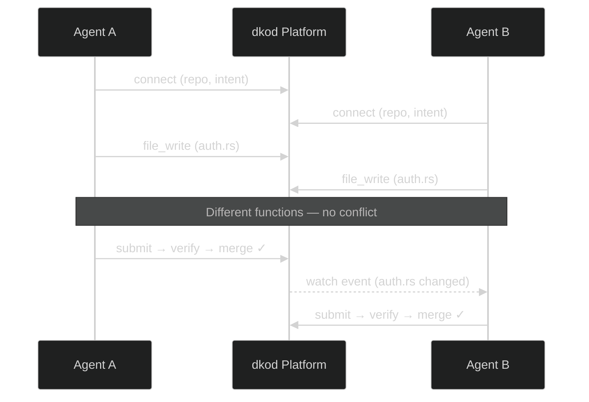

<div align="center">
<br>

<picture>
  <source media="(prefers-color-scheme: dark)" srcset="https://dkod.io/favicon.png">
  <source media="(prefers-color-scheme: light)" srcset="https://dkod.io/favicon.png">
  
</picture>

<br>
<br>

<h1>dkod</h1>

<p><strong>The agent-native code platform</strong></p>

<p>
<sub>Multiple AI agents. One codebase. Zero conflicts.</sub>
</p>

<br>

<a href="LICENSE"></a>&nbsp;
<a href="https://dkod.io"></a>&nbsp;
<a href="https://discord.gg/q2xzuNDJ"></a>&nbsp;
<a href="https://twitter.com/dkod_io"></a>

<br>
<br>

<a href="https://dkod.io/docs">Docs</a>&nbsp;&nbsp;·&nbsp;&nbsp;<a href="https://dkod.io/docs/getting-started/quickstart">Quickstart</a>&nbsp;&nbsp;·&nbsp;&nbsp;<a href="https://dkod.io/blog">Blog</a>&nbsp;&nbsp;·&nbsp;&nbsp;<a href="https://discord.gg/q2xzuNDJ">Community</a>

<br>
<br>

</div>

---

<br>

> **AI agents are the new default authors of code.**<br>
> But the infrastructure wasn't built for them — until now.

<br>

dkod lets multiple AI coding agents work on the same repository **simultaneously** — without merge conflicts, file locks, or broken builds. Built for teams running Cursor, Claude Code, Cline, Windsurf, Codex, and any MCP-compatible agent.

<br>

<table>
<tr>
<td width="50%">

### &nbsp;&nbsp;Session Isolation

Each agent gets an **isolated workspace overlay**. Writes go to the overlay, reads fall through to the shared base. No clones. No locks. No waiting.

*10 agents, one repo, zero interference.*

</td>
<td width="50%">

### &nbsp;&nbsp;Semantic Merging

Conflicts detected at the **symbol level** — functions, types, constants — not line-by-line. Two agents editing different functions in the same file? No conflict.

*Your merge tool finally understands code.*

</td>
</tr>
<tr>
<td width="50%">

### &nbsp;&nbsp;Verification Pipeline

Every changeset runs through **lint, type-check, and test** gates before merge. Agents get structured feedback and fix issues autonomously.

*Ship verified code, not hopeful code.*

</td>
<td width="50%">

### &nbsp;&nbsp;Agent Protocol

A purpose-built gRPC protocol for AI agents. Connect, write, submit, verify, merge — all through structured machine-readable APIs.

`CONNECT → CONTEXT → SUBMIT → VERIFY → MERGE`

</td>
</tr>
</table>

<br>

## Quick Start

**Install the CLI**

```bash
cargo install --git https://github.com/dkod-io/dkod-engine dk-cli
```

**Connect to a repository and start coding**

```bash
dk login
dk init my-org/my-repo --intent "add new feature"
dk cat src/main.rs
dk add src/main.rs --content "fn main() { ... }"
dk commit -m "add feature"
dk check
dk push
```

<br>

<details>
<summary><b>Use with Claude Code / MCP</b></summary>

<br>

Add to your MCP settings:

```json
{
  "mcpServers": {
    "dkod": {
      "command": "dk",
      "args": ["mcp"]
    }
  }
}
```

Then use the agent protocol directly:

```
dk_connect  →  open a session
dk_context  →  semantic code search
dk_file_write  →  edit files in your overlay
dk_submit  →  submit changeset
dk_verify  →  run verification pipeline
dk_merge  →  merge to main
```

</details>

<details>
<summary><b>Use with Cursor / Cline / Windsurf</b></summary>

<br>

Each agent connects through the same MCP bridge. See the [agent setup docs](https://dkod.io/docs) for per-editor configuration.

</details>

<br>

## Architecture

```
dkod-engine/
│
├── dk-core          Shared types, error handling
├── dk-engine        Storage: Git layer + semantic graph (tree-sitter, Tantivy)
├── dk-protocol      Agent Protocol — gRPC server (tonic + CONNECT)
├── dk-runner        Verification pipeline runner
├── dk-agent-sdk     Rust SDK for AI agents
├── dk-cli           CLI — drop-in git alternative
├── dk-server        Reference server binary
│
├── sdk/python       Python SDK
└── proto/           Protocol buffer definitions
```

<br>



<br>

## Build from Source

```bash
# Requirements: Rust 1.88+, PostgreSQL 16+, protoc

cargo build --workspace       # build everything
cargo test --workspace        # run tests
```

<br>

## Community

<div align="center">

<a href="https://discord.gg/q2xzuNDJ"></a>&nbsp;&nbsp;
<a href="https://twitter.com/dkod_io"></a>&nbsp;&nbsp;
<a href="https://github.com/dkod-io/dkod-engine/issues"></a>

</div>

<br>

## License

MIT — use it, fork it, build with it.

<br>

<div align="center">
<sub>Built for the age of AI-native development.</sub>
</div>
